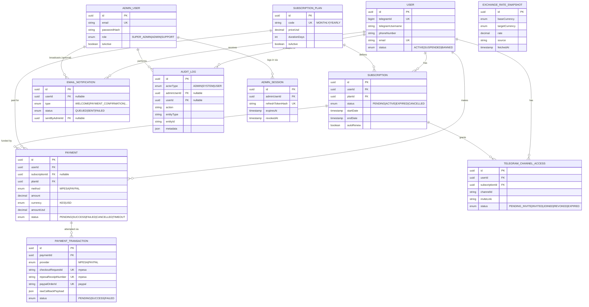

# Database Schema

PostgreSQL + Prisma. Full schema: `backend/prisma/schema.prisma`.
Migrations: `backend/prisma/migrations/`.

## ER Diagram



## Key Design Decisions

**Payment vs. PaymentTransaction split.** `Payment` is the business-level intent ("user X is paying for plan Y"). `PaymentTransaction` is the raw, provider-level record of a single gateway attempt — this is where idempotency lives. `checkoutRequestId`, `mpesaReceiptNumber`, and `paypalOrderId` are all unique at the DB level, so a retried M-Pesa callback or a duplicate PayPal webhook can never activate a subscription twice, no matter what the application code does. One `Payment` can have multiple `PaymentTransaction` rows if a user retries a failed checkout.

**One active subscription per user, enforced by Postgres.** Prisma's schema syntax doesn't support partial unique indexes directly, so this is added via raw SQL in the second migration:
```sql
CREATE UNIQUE INDEX "subscriptions_one_active_per_user"
    ON "subscriptions" ("userId") WHERE "status" = 'ACTIVE';
```
This closes the race condition present in the original prototype, where two concurrent payment callbacks could both "succeed" against the same in-memory object.

**Subscription lifecycle.** `PENDING` (created when checkout starts) → `ACTIVE` (on verified payment success) → `EXPIRED` (flipped by a scheduled job when `endDate` passes) or `CANCELLED` (admin/user action). `startDate`/`endDate` are only set on activation, not at creation — a `PENDING` subscription that never gets paid for has no dates and doesn't block a future attempt.

**Amounts stored in both original currency and USD.** M-Pesa charges in KES, PayPal in USD. `Payment.amount` + `Payment.currency` records what was actually charged; `Payment.amountUsd` is normalized for reporting/dashboards regardless of gateway. `exchangeRate` records what rate was used, sourced from `ExchangeRateSnapshot`, so historical reports stay accurate even if today's rate differs.

**Audit trail.** `AuditLog` is generic (`entityType` + `entityId` + `metadata` JSON) so it can log admin actions (suspend user, extend subscription), system actions (auto-expiry), and is queryable per-entity without a table per action type.

## Indexes & Constraints Summary

| Table | Constraint | Purpose |
|---|---|---|
| `subscriptions` | partial unique `(userId) WHERE status='ACTIVE'` | prevent duplicate active subscriptions |
| `subscriptions` | check `endDate > startDate` | data integrity |
| `payment_transactions` | unique `checkoutRequestId`, `mpesaReceiptNumber`, `paypalOrderId` | callback idempotency |
| `payments` | check `amount > 0`, `amountUsd > 0` | reject malformed/zero-amount records |
| `subscription_plans` | check `priceUsd > 0`, `durationDays > 0` | reject invalid plan config |
| `users` | unique `telegramId`, `email` | one account per Telegram user |
| `admin_sessions` | unique `refreshTokenHash` | session/refresh-token integrity |
| most FKs | `ON DELETE CASCADE` / `SET NULL` per relation semantics | see schema comments |
